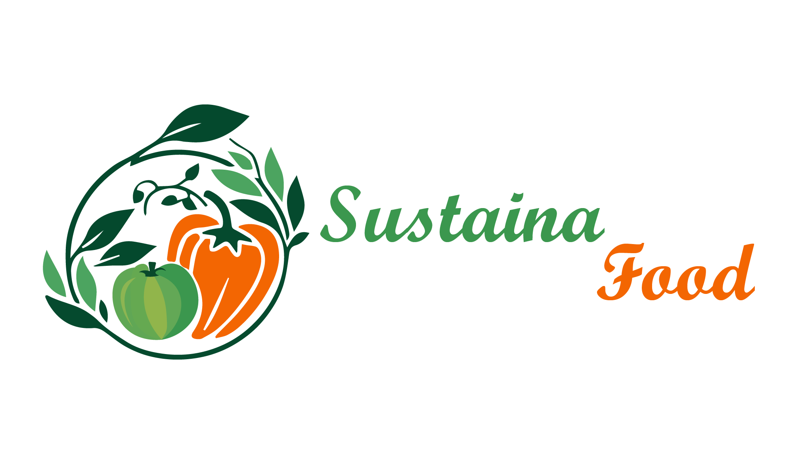

Sustainafood
<p align="center">
  <a href="" rel="noopener">
  </a>
  <br/>
</p>


**Group:** AbyssalCoding  
<p align="center">
  
</p>
**Tagline:** _Reducing food waste, sustaining lives._

## 📝 Description

Sustainafood is a platform designed to **reduce food waste in markets and supermarkets** by creating a structured, intelligent system for showcasing products and optimizing the flow between providers and demanders. Through a clean UI and smart features, Sustainafood supports both environmental goals and business efficiency.

---

## 🌍 Motivation

Every year, tons of edible food are wasted due to poor stock management and inefficient distribution. **Sustainafood** was built to tackle this issue head-on by:

- Helping markets avoid financial losses due to expired stock.
- Assisting in the fight against **famine and poverty**.
- Encouraging sustainable, eco-friendly practices in food retail and distribution.
- Creating a **smart, AI-enhanced experience** that adapts and improves over time.

---

## ⚙️ Tech Stack

- **Frontend:** React.js + Tailwind CSS
- **Backend:** Node.js + Express.js
- **Database:** MongoDB
- **Authentication:** JWT (JSON Web Tokens)
- **API Communication:** Axios
- **Containerization:** Docker
- **CI/CD Pipeline:** Jenkins
- **AI Integration:** Custom modules to optimize user experience and product distribution

---

## 📌 Features
🛒 Product Catalog: Show available food items and their status
🔄 Provider-Demander Flow Management: Optimize supply and demand
🧠 AI Assistance: Personalized suggestions and stock optimization
📊 Stock Monitoring: Avoid expiry and overstocking
🧾 Secure Auth: JWT-based login and registration
📦 Dockerized Setup: For fast and isolated development
🔁 CI/CD Pipeline: Automated builds and deployment via Jenkins

## 🚀 Getting Started

### 📦 Prerequisites

- Node.js ≥ 16
- MongoDB
- Docker & Docker Compose
- Jenkins (for CI/CD)
- Git

### 🛠️ Installation

```bash
# Clone the repo
git clone https://github.com/AbyssalCoding/sustainafood.git
cd sustainafood

# Install backend dependencies
cd backend
npm install

# Install frontend dependencies
cd ../frontend
npm install
```
🐳 Run with Docker
# In the root directory
docker-compose up --build
